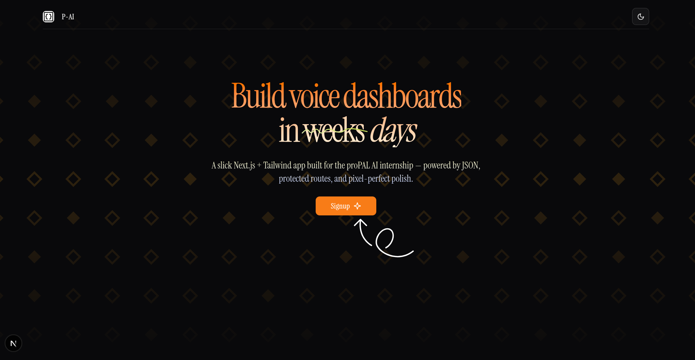

# 🔐 proPAL AI – Frontend Engineering Assignment

A modern authentication + dashboard web app built with **Next.js App Router**, **Tailwind CSS**, and **React Hook Form + Zod**, developed as part of the internship task for [proPAL AI](https://propalai.com).

## ✨ Features

- ✅ Landing Page with CTA
- ✅ Signup & Login Forms (with validation)
- ✅ Authentication System (with Context API + LocalStorage)
- ✅ Protected Dashboard
- ✅ Profile Management (update email & password)
- ✅ STT Configurator with interdependent dropdowns
- ✅ Summary card showing selected provider, model, and language
- ✅ State persistence via `localStorage`
- 🌘 Dark Mode Support (bonus)
- ⚡ Smooth UI interactions with shadcn/ui & Tailwind transitions

---

## 📸 Screenshot

> _Landing Page + Dashboard Preview_



---

## 🧠 Tech Stack

- **Next.js (App Router)**
- **Tailwind CSS** + Dark Mode
- **React Context API** for auth
- **Zod + React Hook Form** for validations
- **Shadcn/ui** for consistent components
- **LocalStorage** for state persistence
- **File-based data** via `/public/users.json` & `/public/stt.json`

---

## 🚀 Getting Started

```bash
git clone https://github.com/your-username/propal-frontend-assignment.git
cd propal-frontend-assignment
pnpm install
pnpm dev
